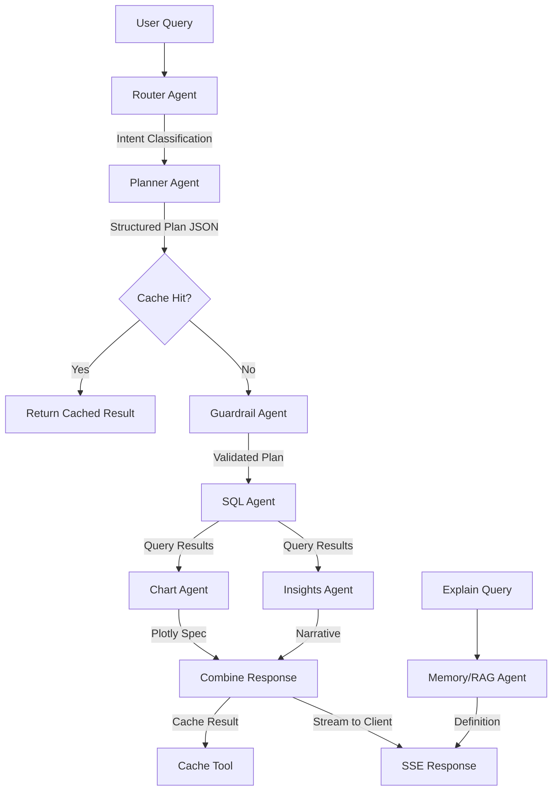

# Design Document

## Overview

Topup is a conversational CXO assistant built with a Next.js frontend and FastAPI backend. The system uses LangChain + LangGraph for agent orchestration, enabling natural language queries over SQLite databases (cps_tb and forecast_df) with streaming responses, interactive Plotly charts, and executive insights. The architecture prioritizes sub-3-second latency through SSE streaming, Redis caching, and pre-aggregated views.

## Architecture

### High-Level System Architecture

```
┌─────────────────────────────────────────────────────────────┐
│                        Client Layer                          │
│  ┌────────────────────────────────────────────────────────┐ │
│  │  Next.js 15 App Router (React Server Components)       │ │
│  │  - Chat UI with SSE streaming                          │ │
│  │  - Plotly chart rendering                              │ │
│  │  - Segment filters & time chips                        │ │
│  │  - TailwindCSS + shadcn/ui                            │ │
│  └────────────────────────────────────────────────────────┘ │
└─────────────────────────────────────────────────────────────┘
                            │ HTTP/SSE
                            ▼
┌─────────────────────────────────────────────────────────────┐
│                         API Layer                            │
│  ┌────────────────────────────────────────────────────────┐ │
│  │  FastAPI                                               │ │
│  │  - /chat (SSE streaming endpoint)                     │ │
│  │  - /chart (chart spec retrieval)                      │ │
│  │  - /suggest (follow-up questions)                     │ │
│  │  - /export (CSV/PNG download)                         │ │
│  └────────────────────────────────────────────────────────┘ │
└─────────────────────────────────────────────────────────────┘
                            │
                            ▼
┌─────────────────────────────────────────────────────────────┐
│                    Orchestration Layer                       │
│  ┌────────────────────────────────────────────────────────┐ │
│  │  LangChain + LangGraph Agent Graph                    │ │
│  │                                                        │ │
│  │  Router → Planner → SQL → Chart → Insights           │ │
│  │              ↓                                         │ │
│  │         Memory/RAG                                     │ │
│  │              ↓                                         │ │
│  │          Guardrail                                     │ │
│  └────────────────────────────────────────────────────────┘ │
└─────────────────────────────────────────────────────────────┘
                            │
                ┌───────────┴───────────┐
                ▼                       ▼
┌──────────────────────┐    ┌──────────────────────┐
│   Data Layer         │    │   Cache Layer        │
│  ┌────────────────┐  │    │  ┌────────────────┐  │
│  │ SQLite (RO)    │  │    │  │ Redis          │  │
│  │ - cps_tb       │  │    │  │ - Query cache  │  │
│  │ - forecast_df  │  │    │  │ - TTL: 10 min  │  │
│  └────────────────┘  │    │  └────────────────┘  │
│  ┌────────────────┐  │    │  ┌────────────────┐  │
│  │ Chroma (RAG)   │  │    │  │ Pre-agg views  │  │
│  │ - Schema docs  │  │    │  │ - 90d weekly   │  │
│  │ - KPI glossary │  │    │  └────────────────┘  │
│  └────────────────┘  │    └──────────────────────┘
└──────────────────────┘
```

### Agent Graph Flow



## Components and Interfaces

### Frontend Components (Next.js)

#### 1. Chat UI Components

**ChatWindow.tsx**
- Renders message list with auto-scroll
- Displays user and assistant messages
- Handles streaming message updates
- Manages scroll-to-bottom behavior

**ChatMessage.tsx**
- Renders individual message bubbles
- Differentiates user vs assistant styling
- Supports markdown formatting
- Displays timestamps

**ChatInput.tsx**
- Multiline text input with auto-resize
- Send button with loading state
- Stop button for canceling streaming
- Slash-command support (/trend, /forecast, /funnel)

**Toolbar.tsx**
- Quick time period chips (Last 7d, Last 30d, etc.)
- Segment filter dropdowns
- Theme toggle button
- Export controls

#### 2. Chart Components

**Plot.tsx**
- Thin wrapper around react-plotly.js
- Handles theme-aware color schemes
- Manages responsive sizing
- Provides hover tooltips

**ChartCard.tsx**
- Card container for charts
- Title and metadata display
- Export menu (PNG, CSV)
- "Explain" button for insights

#### 3. Filter Components

**SegmentFilter.tsx**
- Combobox for segment selection
- Multi-select support
- Displays allowed values from API
- Clear/reset functionality

#### 4. State Management (Zustand)

```typescript
interface ChatStore {
  messages: Message[];
  running: boolean;
  filters: SegmentFilters;
  pushUser: (text: string) => void;
  pushAssistant: (content: any) => void;
  setRunning: (running: boolean) => void;
  setFilters: (filters: SegmentFilters) => void;
  clearMessages: () => void;
}
```

#### 5. SSE Hook

```typescript
function useSSE(
  url: string,
  onMessage: (data: any) => void,
  onDone?: () => void
): { close: () => void }
```

### Backend Components (FastAPI)

#### 1. API Endpoints

**POST /chat**
- Accepts: `{ message: string, filters?: SegmentFilters }`
- Returns: SSE stream with `text/event-stream`
- Streams: partial messages, plan, chart, insights, done signal

**GET /chart**
- Accepts: `{ cache_key: string }`
- Returns: `{ plotly: PlotlySpec, data: DataFrame, explanation: string }`

**GET /suggest**
- Accepts: `{ context: string, last_intent: string }`
- Returns: `{ suggestions: string[] }`

**GET /export**
- Accepts: `{ cache_key: string, format: 'csv' | 'png' }`
- Returns: File download (CSV or PNG)

#### 2. Agent Components

**Router Agent**
- Input: User query string
- Output: Intent classification (trend, variance, forecast_vs_actual, funnel, distribution, relationship, explain)
- Uses: OpenAI function calling with enum constraint
- Prompt: Few-shot examples for each intent type
- Terminology: Recognizes "app submits", "app approvals", and "issuances" as business-friendly terms

**Planner Agent**
- Input: User query + intent
- Output: Structured Plan JSON (Pydantic model)
- Uses: OpenAI structured outputs
- Validates: Table, metric, date_col, window, granularity, segments, chart type
- Applies: Default rules (30d window, weekly for ≤3mo, FICO sort order)
- Metric Interpretation: Defaults to amounts for App Submits, App Approvals, and Issuances unless user explicitly requests counts

**SQL Agent**
- Input: Plan JSON
- Output: pandas DataFrame
- Process:
  1. Select template from whitelist based on intent
  2. Bind parameters from plan.segments
  3. Execute read-only query
  4. Apply row limit (10,000)
  5. Log query + latency

**Chart Agent**
- Input: Plan JSON + DataFrame
- Output: Plotly JSON specification
- Logic:
  - Trend → line/area chart
  - Forecast vs actual → grouped bar
  - Funnel → funnel chart
  - Distribution → pie/histogram
  - Relationship → scatter
- Applies: Theme colors, FICO sort order, annotations

**Insights Agent**
- Input: Plan JSON + DataFrame
- Output: `{ title, summary, bullets, drivers }`
- Calculates:
  - MoM/WoW percentage deltas
  - Top 3 positive/negative segment drivers
  - Forecast accuracy metrics
  - Conversion rates for funnels
- Generates: Executive one-liner + 2-3 bullet points

**Memory/RAG Agent**
- Input: User question
- Output: Definition or schema explanation
- Uses: Chroma vector DB with embeddings
- Indexed: Schema docs, KPI glossary, field value profiles, 25-50 Q&A exemplars
- Retrieval: Top-k semantic search (k=3)

**Guardrail Agent**
- Input: Plan JSON + SQL template
- Output: Validated plan or rejection
- Checks:
  - Read-only SQL (no INSERT/UPDATE/DELETE/DROP/ALTER)
  - No semicolons or multi-statements
  - Segment values in allowed list
  - Time window ≤ 1 year (unless explicit)
  - Row limit enforcement

#### 3. Tool Components

**SQL Tool**
- Interface: `run(plan: Plan) -> DataFrame`
- Templates: 6 whitelisted SQL files
  - trend_weekly.sql
  - funnel_last_full_month.sql
  - forecast_vs_actual_weekly.sql
  - mom_delta.sql
  - wow_delta.sql
  - distribution.sql
- Safety: Parameterized queries, read-only connection

**Chart Tool**
- Interface: `build(plan: Plan, df: DataFrame) -> PlotlySpec`
- Generates: JSON specification for Plotly.js
- Handles: Multi-series, annotations, theme colors, axis formatting

**Narrative Tool**
- Interface: `summarize(plan: Plan, df: DataFrame) -> Insight`
- Computes: Deltas, drivers, rankings
- Formats: Executive-level language

**Cache Tool**
- Interface: `get(key: str) -> Optional[CachedResult]`, `set(key: str, value: CachedResult, ex: int)`
- Backend: In-memory LRU cache for Phase 1 (Python dict with TTL), Redis for Phase 2
- Key: Hash of Plan JSON
- Value: `{ df: DataFrame, chart: PlotlySpec, insight: Insight }`
- Phase 1: Simple dict with timestamp-based expiration
- Phase 2: Migrate to Redis for multi-instance support

**RAG Tool**
- Interface: `retrieve(query: str, k: int) -> List[Document]`
- Backend: Chroma (in-process)
- Embeddings: OpenAI text-embedding-3-small
- Index: Schema + KPI definitions

## Data Models

### Plan Schema (Pydantic)

```python
class Plan(BaseModel):
    intent: Literal["trend", "variance", "forecast_vs_actual", "funnel", "distribution", "relationship", "explain"]
    table: Literal["cps_tb", "forecast_df"]
    metric: str
    date_col: Literal["app_submit_d", "apps_approved_d", "issued_d", "date"]
    window: Literal["last_7d", "last_full_week", "last_30d", "last_full_month", "last_3_full_months"]
    granularity: Literal["daily", "weekly", "monthly"]
    segments: SegmentFilters
    chart: Literal["line", "area", "bar", "grouped_bar", "funnel", "pie", "scatter"]
    
    def cache_key(self) -> str:
        return hashlib.sha256(self.json().encode()).hexdigest()
```

### Segment Filters

```python
class SegmentFilters(BaseModel):
    channel: Optional[str] = None
    grade: Optional[str] = None
    prod_type: Optional[str] = None
    repeat_type: Optional[str] = None
    term: Optional[int] = None
    cr_fico_band: Optional[str] = None
```

### SSE Message Union

```typescript
type SSEMessage =
  | { partial: string }
  | { plan: Plan }
  | { card: { chart: PlotlySpec; insight: Insight } }
  | { done: true }
  | { error: string };
```

### Insight Schema

```python
class Insight(BaseModel):
    title: str
    summary: str  # One-line executive takeaway
    bullets: List[str]  # 2-3 key findings
    drivers: List[Driver]  # Top/bottom segments
    
class Driver(BaseModel):
    segment: str
    value: float
    delta: float
    delta_pct: float
```

### Database Schemas

**cps_tb (Customer Acquisition)**
- app_submit_d: DATE (submission date)
- app_submit_amt: REAL (submitted loan amount)
- apps_approved_d: DATE (approval date)
- approval_amt: REAL (approved loan amount)
- issued_d: DATE (issuance date)
- issued_amt: REAL (issued loan amount)
- channel: TEXT (Email, OMB, etc.)
- grade: TEXT (P1, P2, P3, P4, etc.)
- prod_type: TEXT
- repeat_type: TEXT (NP, RP)
- term: INTEGER
- cr_fico: INTEGER
- cr_fico_band: TEXT (<640, 640-699, 700-759, 760+)
- cr_appr_flag: INTEGER (0/1)
- offered_flag: INTEGER (0/1)
- issued_flag: INTEGER (0/1)
- offer_apr: REAL

**forecast_df (Forecast Data)**
- date: DATE
- channel: TEXT
- grade: TEXT
- forecast_issuance: INTEGER
- actual_issuance: INTEGER

## Error Handling

### Client-Side Error Handling

1. **Network Errors**
   - Display toast notification
   - Retry button for failed requests
   - Fallback to cached data if available

2. **SSE Connection Errors**
   - Auto-reconnect with exponential backoff
   - Max 3 retry attempts
   - Display connection status indicator

3. **Validation Errors**
   - Inline form validation
   - Clear error messages for invalid segments
   - Suggest corrections for typos

### Server-Side Error Handling

1. **SQL Execution Errors**
   - Log full error with context
   - Return user-friendly message
   - Suggest query reformulation

2. **Agent Failures**
   - Retry logic with max 2 attempts
   - Fallback to simpler query plan
   - Graceful degradation (skip insights if chart succeeds)

3. **Timeout Handling**
   - 30-second timeout for SQL queries
   - 60-second timeout for full agent graph
   - Stream partial results before timeout

4. **Cache Failures**
   - Continue without cache on Redis errors
   - Log cache misses for monitoring
   - Degrade gracefully to direct SQL

### Guardrail Violations

1. **SQL Injection Attempts**
   - Reject immediately
   - Log security event
   - Return generic error (no details)

2. **Invalid Segments**
   - Return list of allowed values
   - Suggest closest match
   - Allow query to proceed without invalid segment

3. **Performance Limits**
   - Enforce row limit (10,000)
   - Warn on large time windows
   - Suggest narrower filters

## Testing Strategy

### Unit Tests

1. **Agent Tests**
   - Router: Intent classification accuracy (>95%)
   - Planner: Structured output validation
   - SQL Agent: Template parameter binding
   - Chart Agent: Plotly spec generation
   - Insights Agent: Delta calculations

2. **Tool Tests**
   - SQL Tool: Read-only enforcement
   - SQL Tool: NULLIF division guards
   - Cache Tool: TTL expiration
   - RAG Tool: Retrieval relevance

3. **Utility Tests**
   - Date window calculations
   - FICO band sorting
   - Hash key generation

### Integration Tests

1. **End-to-End Query Flows**
   - Trend query: user input → chart + insights
   - Forecast vs actual: plan → grouped bar
   - Funnel query: 3-stage conversion
   - Explain query: RAG retrieval

2. **SSE Streaming**
   - Partial message delivery
   - Connection handling
   - Error propagation

3. **Cache Behavior**
   - Cache hit/miss scenarios
   - TTL expiration
   - Key collision handling

### Performance Tests

1. **Latency Benchmarks**
   - P50 < 2.5s for cached queries
   - P50 < 3.5s for uncached queries
   - P95 < 6s for complex queries

2. **Load Tests**
   - 100 concurrent users
   - 1000 queries/minute
   - Cache hit rate > 60%

3. **Database Performance**
   - Query execution time < 500ms
   - Pre-aggregated view usage
   - Index effectiveness

### Security Tests

1. **SQL Injection**
   - Attempt malicious inputs
   - Verify rejection
   - Confirm no data leakage

2. **Input Validation**
   - Invalid segment values
   - Malformed JSON
   - XSS attempts in chat

3. **Rate Limiting**
   - Excessive requests
   - DDoS simulation
   - Resource exhaustion

## KPI Calculation Rules

### Standard Metrics

**Note**: By default, App Submits, App Approvals, and Issuances refer to dollar amounts (sum of loan amounts), not counts. Users must explicitly request "number of" or "count of" to get transaction counts.

1. **App Submits (Amount)**: `SUM(app_submit_amt)` - Default for "app submits" or "submissions"
2. **App Submits (Count)**: `COUNT(app_submit_d)` - Only when explicitly requested as "number of app submits"
3. **App Approvals (Amount)**: `SUM(CASE WHEN cr_appr_flag = 1 THEN approval_amt ELSE 0 END)` - Default for "app approvals" or "approvals"
4. **App Approvals (Count)**: `SUM(cr_appr_flag)` - Only when explicitly requested as "number of app approvals"
5. **Issuances (Amount)**: `SUM(CASE WHEN issued_flag = 1 THEN issued_amt ELSE 0 END)` - Default for "issuances"
6. **Issuances (Count)**: `SUM(issued_flag)` - Only when explicitly requested as "number of issuances"
7. **Approval Rate**: `SUM(cr_appr_flag) / NULLIF(SUM(offered_flag), 0)` - Always a percentage
8. **Funding Rate**: `SUM(issued_flag) / NULLIF(COUNT(app_submit_d), 0)` - Always a percentage
9. **Average APR**: `AVG(offer_apr)`
10. **Average FICO**: `AVG(cr_fico)`

### Forecast Metrics

1. **Forecast Delta**: `actual_issuance - forecast_issuance`
2. **Forecast Accuracy**: `actual_issuance / NULLIF(forecast_issuance, 0)`
3. **Absolute Error**: `ABS(actual_issuance - forecast_issuance)`
4. **MAPE**: `AVG(ABS((actual - forecast) / NULLIF(forecast, 0)))`

### Variance Metrics

1. **MoM Delta**: `(current_month - prior_month) / NULLIF(prior_month, 0)`
2. **WoW Delta**: `(current_week - prior_week) / NULLIF(prior_week, 0)`
3. **YoY Delta**: `(current_year - prior_year) / NULLIF(prior_year, 0)`

## Date Window Logic (SQLite)

### Time Period Definitions

1. **Last 7 Days**
   ```sql
   WHERE date_col BETWEEN date('now', '-7 day') AND date('now')
   ```

2. **Last Full Week (Mon-Sun)**
   ```sql
   WHERE date_col BETWEEN 
     date('now', 'weekday 0', '-7 days') AND 
     date('now', 'weekday 0')
   ```

3. **Last 30 Days**
   ```sql
   WHERE date_col BETWEEN date('now', '-30 day') AND date('now')
   ```

4. **Last Full Month**
   ```sql
   WHERE date_col BETWEEN 
     date('now', 'start of month', '-1 month') AND 
     date('now', 'start of month')
   ```

5. **Last 3 Full Months (excluding current)**
   ```sql
   WHERE date_col BETWEEN 
     date('now', 'start of month', '-4 month') AND 
     date('now', 'start of month', '-1 month')
   ```

### Granularity Bucketing

1. **Daily**: `date(date_col) AS day`
2. **Weekly**: `strftime('%Y-%W', date_col) AS week`
3. **Monthly**: `strftime('%Y-%m', date_col) AS month`

## Caching Strategy

### Cache Key Generation

```python
def cache_key(plan: Plan) -> str:
    # Hash the plan JSON for deterministic keys
    return hashlib.sha256(plan.json().encode()).hexdigest()
```

### Cache Invalidation

- TTL: 10 minutes for query results
- Manual invalidation: On data refresh (nightly)
- Eviction policy: LRU for memory-based cache

### Pre-Aggregated Views

```sql
-- Weekly rollup (last 90 days) - Amounts by default
CREATE VIEW weekly_rollup AS
SELECT 
  strftime('%Y-%W', app_submit_d) AS week,
  channel,
  grade,
  SUM(app_submit_amt) AS app_submits_amt,
  SUM(CASE WHEN cr_appr_flag = 1 THEN approval_amt ELSE 0 END) AS app_approvals_amt,
  SUM(CASE WHEN issued_flag = 1 THEN issued_amt ELSE 0 END) AS issuances_amt,
  COUNT(app_submit_d) AS app_submits_count,
  SUM(cr_appr_flag) AS app_approvals_count,
  SUM(issued_flag) AS issuances_count
FROM cps_tb
WHERE app_submit_d >= date('now', '-90 day')
GROUP BY 1, 2, 3;
```

## Observability

### Structured Logging

```python
{
  "timestamp": "2025-11-10T14:32:15Z",
  "session_id": "abc123",
  "user_text": "Show WoW issuance by channel",
  "intent": "trend",
  "plan": {...},
  "sql": "SELECT...",
  "row_count": 24,
  "latency_ms": 1850,
  "cache_hit": false
}
```

### Metrics

- Query latency (P50, P95, P99)
- Cache hit rate
- Agent execution time per stage
- Error rate by type
- Concurrent users

### Monitoring Dashboards

1. **Performance Dashboard**
   - Latency trends
   - Cache effectiveness
   - Query volume

2. **Error Dashboard**
   - Error rate by type
   - Failed queries
   - Timeout frequency

3. **Usage Dashboard**
   - Popular intents
   - Common segments
   - Time window distribution

## Security & Governance

### SQL Safety

1. Read-only database connection
2. Whitelisted SQL templates only
3. Parameterized queries (no string interpolation)
4. No multi-statement execution
5. Keyword blacklist (INSERT, UPDATE, DELETE, DROP, ALTER)

### Input Validation

1. Segment values against allowed distinct values
2. Date range limits (max 1 year default)
3. Row count limits (10,000 max)
4. Query timeout (30s SQL, 60s total)

### Data Privacy

1. No PII in logs (scrub if present)
2. Session isolation
3. CORS restrictions
4. Rate limiting per user/IP

## Deployment Architecture

### Phase 1: Local Development (MVP)

```
Next.js dev server (localhost:3000)
  ↓
FastAPI dev server (localhost:8000)
  ↓
SQLite (local file: ./data/topup.db)
Chroma (in-process, persistent: ./data/chroma)
In-memory LRU cache (Python dict with TTL)
```

**Setup Commands:**
```bash
# Backend
cd topup-backend
python -m venv venv
source venv/bin/activate  # Windows: venv\Scripts\activate
pip install -r requirements.txt
uvicorn app.main:app --reload --port 8000

# Frontend
cd topup-frontend
pnpm install
pnpm dev
```

**Environment Variables (.env):**
```
# Backend
DATABASE_URL=./data/topup.db
CHROMA_PATH=./data/chroma
OPENAI_API_KEY=sk-...
CACHE_TYPE=memory  # Use in-memory cache for MVP

# Frontend
NEXT_PUBLIC_API=http://localhost:8000
```

### Phase 2: Production Deployment (Future)

```
Next.js (Vercel/CDN)
  ↓
FastAPI (Docker + Nginx)
  ↓
SQLite (read-replica)
Chroma (persistent volume)
Redis (managed service)
```

**Docker Compose (Phase 2):**
```yaml
services:
  api:
    build: ./topup-backend
    ports:
      - "8000:8000"
    environment:
      - DATABASE_URL=/data/topup.db
      - REDIS_URL=redis://redis:6379
      - OPENAI_API_KEY=${OPENAI_API_KEY}
    volumes:
      - ./data:/data
  
  redis:
    image: redis:7-alpine
    ports:
      - "6379:6379"
  
  frontend:
    build: ./topup-frontend
    ports:
      - "3000:3000"
    environment:
      - NEXT_PUBLIC_API=http://localhost:8000
```

## Technology Choices Rationale

### Next.js over React SPA

- Server components for instant skeleton rendering
- File-system routing reduces boilerplate
- SSR/SSG for help pages and glossary
- Edge/CDN friendliness for static assets
- Better SEO for internal documentation

### FastAPI over Flask/Django

- Native async/await for SSE streaming
- Automatic OpenAPI documentation
- Pydantic validation
- High performance (Starlette + Uvicorn)

### LangGraph over LangChain Chains

- Durable, controllable agent runs
- Easy multi-tool orchestration
- Built-in retry logic
- State management across steps

### Chroma over Pinecone/FAISS

- In-process (no external service)
- Simple setup for MVP
- Sufficient for small index (<1000 docs)
- Can migrate to FAISS/Pinecone later

### Plotly over D3/Chart.js

- Interactive out-of-the-box
- JSON-based (easy server generation)
- Export to PNG/SVG built-in
- Wide browser support

### In-Memory Cache for Phase 1, Redis for Phase 2

- Phase 1: Simple Python dict with TTL for rapid local development
- Phase 2: Redis for persistence across restarts and multi-instance support
- TTL support in both implementations
- Easy migration path from memory to Redis

## Performance Optimization

### Latency Budget (Target P50 ≤ 2.5s)

| Stage | Target | Optimization |
|-------|--------|--------------|
| Router | 200ms | Few-shot prompt, enum constraint |
| Planner | 300ms | Structured outputs, cached schema |
| Cache lookup | 10ms | Redis local network |
| SQL execution | 500ms | Indexed queries, pre-agg views |
| Chart generation | 100ms | Template-based Plotly specs |
| Insights | 200ms | Vectorized pandas operations |
| Streaming overhead | 100ms | SSE chunked encoding |
| **Total** | **1.41s** | **Buffer: 1.09s** |

### Optimization Techniques

1. **Stream Early**: Start SSE response before SQL execution
2. **Pre-Aggregate**: Weekly rollups for last 90 days
3. **Cache Aggressively**: 10-min TTL, 60%+ hit rate target
4. **Index Strategically**: date columns, segment columns
5. **Limit Results**: 10,000 row cap
6. **Parallel Execution**: Chart + Insights agents run concurrently

## Future Enhancements

### Phase 2 Features

1. **Docker Deployment**: Containerized backend and frontend with Docker Compose
2. **Redis Cache**: Replace in-memory cache with Redis for persistence and multi-instance support
3. **Multi-Turn Conversations**: Context retention across queries
4. **Saved Queries**: Bookmark and share common analyses
5. **Scheduled Reports**: Email daily/weekly summaries
6. **Custom Metrics**: User-defined KPI formulas
7. **Drill-Down**: Click chart segments to filter
8. **Annotations**: Add notes to specific data points
9. **Alerts**: Threshold-based notifications

### Scalability Improvements (Phase 2+)

1. **Horizontal Scaling**: Multiple FastAPI instances behind load balancer
2. **Database Sharding**: Partition by date range
3. **CDN Caching**: Static chart images
4. **Query Queue**: Rate limiting and prioritization
5. **Materialized Views**: Daily refresh of common aggregations
